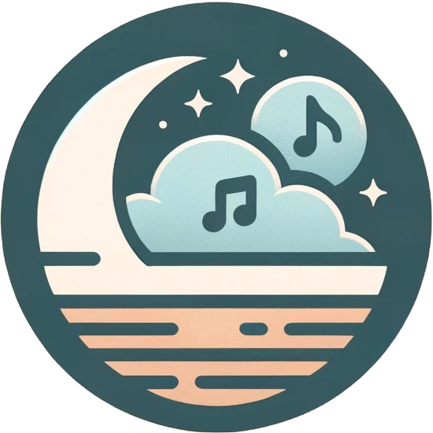

<!-- Improved compatibility of back to top link: See: https://github.com/othneildrew/Best-README-Template/pull/73 -->
<a name="readme-top"></a>
<!--
*** Thanks for checking out the Best-README-Template. If you have a suggestion
*** that would make this better, please fork the repo and create a pull request
*** or simply open an issue with the tag "enhancement".
*** Don't forget to give the project a star!
*** Thanks again! Now go create something AMAZING! :D
-->


<!-- PROJECT LOGO -->
<br />
<div align="center">
  <a href="https://github.com/Serenaid/Serenaid-Frontend">
    
  </a>

<h3 align="center">Serenaid-Frontend</h3>

  <p align="left">
    Serenaid is a mobile application designed to ease your sleeping experience and transport its users through a harmonious journey to dreamland. Leveraging the advanced capabilities of Meta's AudioCraft model through its MusicGen, Serenaid crafts personalized sleeping sounds that cater to your individual relaxation needs.
  <br />
  <br />
  </p>
</div>


<!-- TABLE OF CONTENTS -->
<details>
  <summary>Table of Contents</summary>
  <ol>
    <li>
      <a href="#about-the-project">About The Project</a>
      <ul>
        <li><a href="#built-with">Built With</a></li>
      </ul>
    </li>
    <li>
      <a href="#getting-started">Getting Started</a>
      <ul>
        <li><a href="#prerequisites">Prerequisites</a></li>
        <li><a href="#installation">Installation</a></li>
      </ul>
    </li>
    <li><a href="#usage">Usage</a></li>
    <li><a href="#roadmap">Roadmap</a></li>
    <li><a href="#contact">Contact</a></li>
    <li><a href="#acknowledgments">Acknowledgments</a></li>
  </ol>
</details>


<!-- ABOUT THE PROJECT -->
## About The Project

* **Personalized Experience**: By inputting text prompts, users can generate custom sleeping sounds that align with their personal preferences and needs, creating a tailored relaxation experience each night.
* **AI-Driven Soundscapes**: Leveraging Meta's AudioCraft, Serenaid employs generative AI to produce a wide array of sounds, from calming nature backdrops to serene musical compositions.
* **Ease of Use**: Designed with user-friendliness in mind, Serenaid offers an intuitive interface, allowing users to navigate seamlessly and generate their perfect sleeping ambiance within moments.
* **Cross-Platform Accessibility**: Built using React Native, Serenaid is accessible across various devices, ensuring a broad audience can benefit from its features, whether on iOS or Android platforms.

<p align="right">(<a href="#readme-top">back to top</a>)</p>


### Built With

* [![React][React.js]][React-url]
* [![Node][Node.js]][Node-url]

<p align="right">(<a href="#readme-top">back to top</a>)</p>

<!-- GETTING STARTED -->
## Getting Started

### Prerequisites

This is an example of how to list things you need to use the software and how to install them.
* npm
* Android Studio

### Installation

1. Clone the repo and change working directory
   ```sh
   git clone https://github.com/Serenaid/Serenaid-Frontend
   cd Serenaid-Frontend/
   ```
2. Install NPM packages
   ```sh
   npm install
   ```
3. Install Pod dependencies (iOS)
  ```sh
  cd ios/
  pod install
  ```

#### Clean Cache
1. Change working directory to project root
2. Remove lockfiles
  ```sh
   rm -rf node_modules/
   rm Gemfile.lock
   rm package-lock.json
   rm ios/Podfile.lock
   ```

<p align="right">(<a href="#readme-top">back to top</a>)</p>


<!-- USAGE EXAMPLES -->
<!-- ## Usage

Use this space to show useful examples of how a project can be used. Additional screenshots, code examples and demos work well in this space. You may also link to more resources.

_For more examples, please refer to the [Documentation](https://example.com)_

<p align="right">(<a href="#readme-top">back to top</a>)</p> -->


<!-- ROADMAP -->
## Roadmap

- [ ] Home Screen
  - [ ] Text Input Field (for generation)
  - [ ] Animations

<p align="right">(<a href="#readme-top">back to top</a>)</p>


<!-- CONTACT -->
## Contact

Sam Sui - ssui@vols.utk.edu

Project Link: [https://github.com/Serenaid/Serenaid-Frontend](https://github.com/Serenaid/Serenaid-Frontend)

<p align="right">(<a href="#readme-top">back to top</a>)</p>


<!-- ACKNOWLEDGMENTS -->
## Acknowledgments

* [Michael Villarreal](https://tmvllrrl.github.io/)
* Jiawei Chen
* Maria Hernandez
* Connor Saxon

<p align="right">(<a href="#readme-top">back to top</a>)</p>


<!-- MARKDOWN LINKS & IMAGES -->
<!-- https://www.markdownguide.org/basic-syntax/#reference-style-links -->
[Node.js]: https://img.shields.io/badge/Node.js-43853D?style=for-the-badge&logo=node.js&logoColor=white
[Node-url]: https://nodejs.org/en
[React.js]: https://img.shields.io/badge/React-20232A?style=for-the-badge&logo=react&logoColor=61DAFB
[React-url]: https://reactjs.org/
